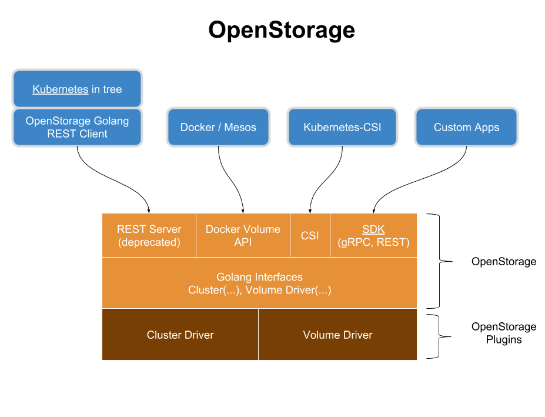

# VMware虚机环境


道云只支持物理机作为PX的生产环境，**不支持虚拟机作为PX的生产环境。**



本章节描述在VMware虚拟机环境中测试PX时，如何尽可能的让PX稳定运行。**如果虚拟机环境不满足此章的要求，无论PX出现的任何问题，道云都不予解答**。


## VMware虚机的配置要求

| \# | 要求 | 描述 |
| :--- | :--- | :--- |
| 1. | 虚机环境独享 | PX的存储节点必须跑在独立的虚机里。这个虚机不跑任何其它的业务。 |
| 2.  | vCPU资源独享 | 虚机的vCPU资源必须全部预留\(Reserve\) |
| 3. | vCPU单槽位 | vCPU配置单槽位\(Socket\) |
| 4 | 内存资源独享 | 虚机的内存资源必须全部预留锁定\(Reserve and Lock\) |
| 5 | 根盘资源独享 | 虚机的根盘必须是厚置备置零\(Thick Provisioning Eager Zero\) |
| 6 | 数据盘资源独享 | 虚机的数据盘必须是RAID卡的PCI穿透\(PCI Pass Through\)或者是裸设备映射\(Raw Device Mapping\) |
| 7 | 优先响应 | 虚机的延迟敏感度\(Latency Sensitivity\)必须设置为高\(High\) |
| 8 | NUMA绑定 | 虚机的必须锁定在一个NUMA NODE上 |
| 9 | 网卡独享 | 虚机里的PX使用PCI穿透的网卡 |

## 配置截图示例

### vCPU配置

### 内存配置

### 根盘配置

### 数据盘RAID卡PCI穿透

### 延迟敏感度配置

### NUMA NODE绑定

### 网卡PCI穿透

